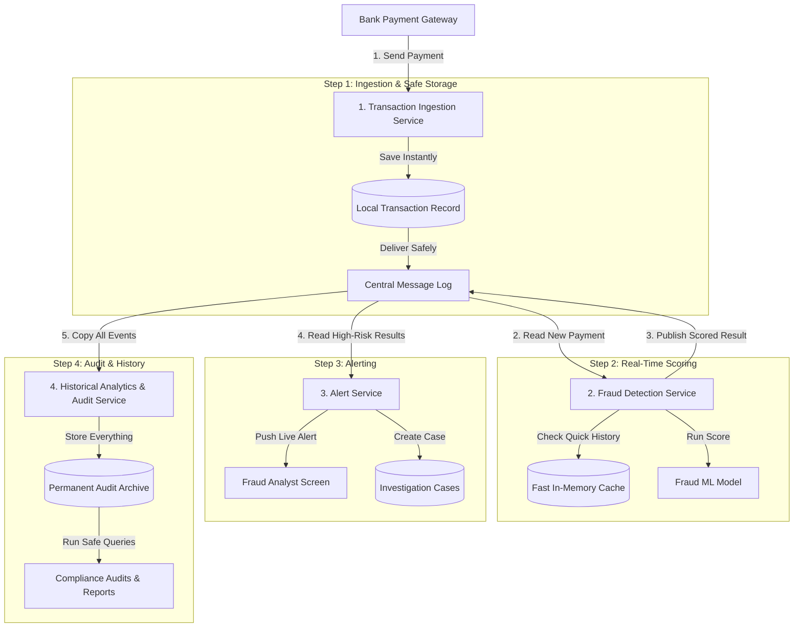
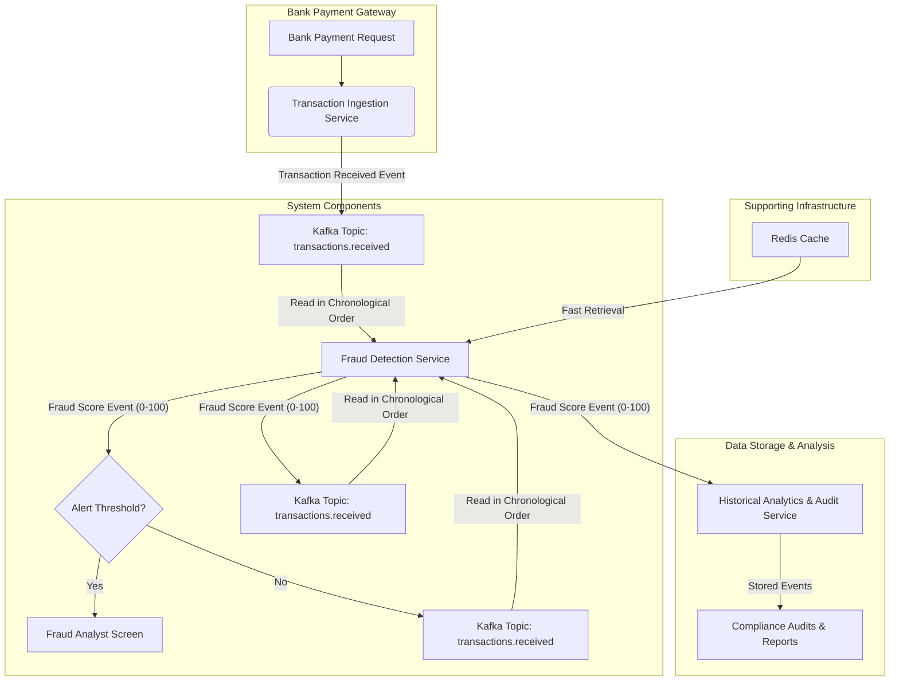
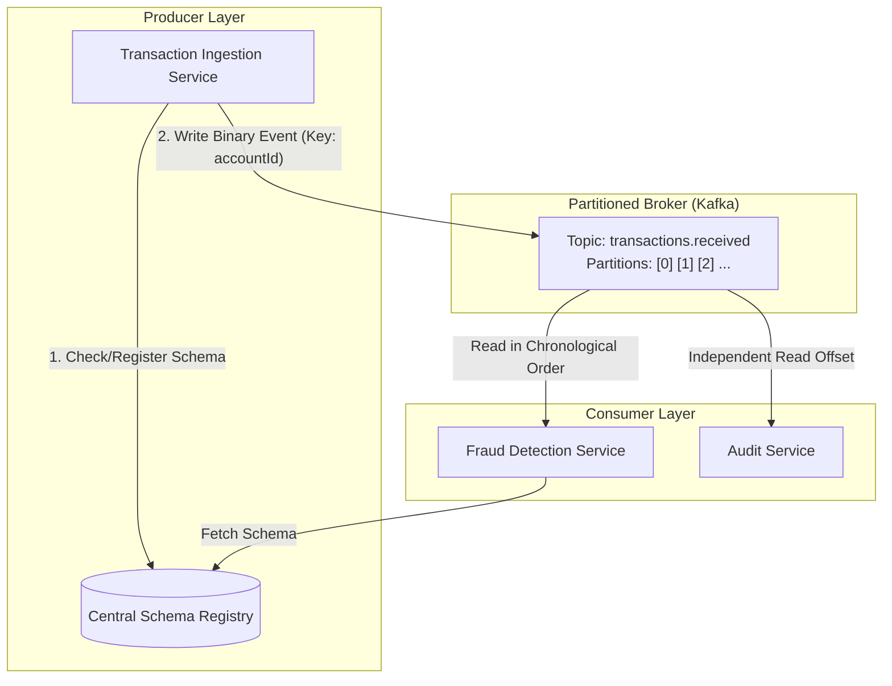
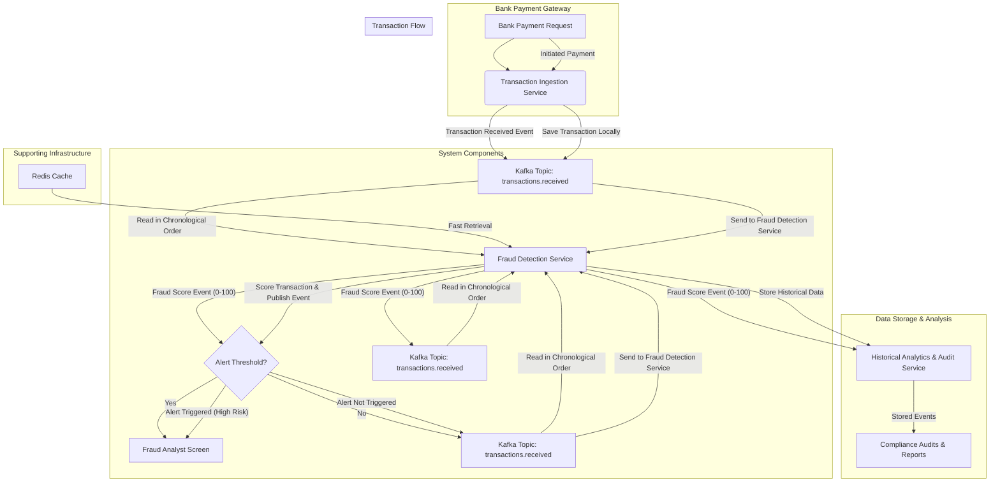

# Fraud Detection Architecture Document

## Executive Summary

The Fraud Detection Architecture Document outlines the design and implementation of a robust financial fraud detection system. This system is designed to handle real-time analysis of transactions with a peak transaction volume of 1,000 TPS and includes features such as elastic scaling, high-precision fraud alerts, comprehensive observability, and historical analytics. The architecture is built on microservices to ensure scalability, reliability, and ease of maintenance.

## Introduction

- **Objective**: This document outlines the architecture for a financial fraud detection system. The system will support real-time analysis of transactions with a peak transaction volume of 1,000 TPS, elastic scaling, transaction fraud alerts, and comprehensive observability.
- **Scope**: The document explains the architecture of a fraud detection system that integrates several microservices to ensure real-time transaction analysis, risk scoring and alerting, and historical analytics.

## System Architecture Overview

- **Summary Description**: The fraud detection system uses microservices and an event-driven architecture to provide real-time analysis of financial transactions and provides alerts for potential fraud. It also includes historical analytics and audit services for comprehensive monitoring and investigation
- **Component Breakdown**:
  - **Transaction Ingestion Service**
  - **Fraud Detection Service**
  - **Alert Service**
  - **Historical Analytics and Audit Service**

## Microservices Architecture Diagram

## Detailed Architecture Description

### Transaction Ingestion Service

- **Description**: Accepts bank payment requests and saves them locally.
- **Inputs**: Bank payment request
- **Outputs**: Bank receipt, Transaction Received event
- **Inter-service Communication**: Sends a Transaction Received event to the Fraud Detection Service
- **Coupling**: Low.

### Fraud Detection Service

- **Description**: Analyzes transactions using a machine learning model and publishes the fraud score.
- **Inputs**: Transaction Received event
- **Outputs**: Fraud Score event (0 to 100 confidence rating)
- **Inter-service Communication**: Recieves a Transaction Received event from Transaction Ingestion Service. Sends a Fraud Score event to Alert Service.
- **Coupling**: High. The service needs deep understanding of transaction data and uses machine learning algorithms.

### Alert Service

- **Description**: Issues alerts for transactions with a high level of fraud confidence.
- **Inputs**: Fraud Score event > 80
- **Outputs**: An alert to fraud frontend and an investigation ticket
- **Inter-service Communication**: Received a Fraud Score event from Fraud Detection Service. Sends an alert to the fraud frontend and creates an investigation ticket.
- **Coupling**: High. The service needs to understand fraud scores and generate appropriate alerts.

### Historical Analytics and Audit Service

- **Description**: Stores historical events for training fraud models and compliance auditing.
- **Inputs**: All events from the central message log
- **Outputs**: A dataset for training fraud models
- **Inter-service Communication**: Receives events from the central message log (transaction receipts, fraud scores). Stores the events in a database for future analysis.
- **Coupling**: Low.

## Solution Architecture Diagram

## Event-Driven Architecture Diagram

## End-to-end Transaction Flow Diagram

## Observability and Alerting

- **Observability Framework**: The fraud detection system uses OpenTelemetry for logging, tracing, and metrics. This framework provides a standardized approach to observability across all system components.
- **Key Metrics**:
  - Latency: Measures the time it takes to complete a transaction.
  - Traffic: Measures the volume of transactions processed
  - Errors: Measures the number and types of errors occurring in the system.
- **SLOs (Service Level Objectives)**:
  - Availability: 99.95% successful HTTP 202 responses
  - Latency: 99% completed in < 20ms at peak 1,000 TPS
  - Frauds: 99% scored and alerted in < 200ms
- **Correlation**:
  - Spans: Each microservice uses OpenTelemetry to create spans that represent individual units of work. These spans are correlated across different services to provide end-to-end tracing. For example, when a transaction is received by the Transaction Ingestion Service, it creates spans that capture details about the request and its processing.
  - Logs: Logs are used to capture detailed application events. Each microservice logs relevant information, which is then unified and correlated with spans to provide a more complete picture of the system's behavior. For instance, logs generated by the Fraud Detection Service capture the transaction score and any anomalies detected. These logs are correlated with spans to correlate them with specific transactions.
  - Metrics: Metrics provide quantitative data about the system’s performance. OpenTelemetry collects metrics such as latency, traffic, and error rates across all components of the system. These metrics are correlated with spans for detailed analysis. For example, if an error is detected in the Fraud Detection Service, metrics such as error counts and types are logged. These metrics are correlated with the corresponding spans to identify which transactions are affected by errors.

## Stack Implementation

- **Apache Kafka**: High-throughput messaging.
- **PostgreSQL**: ACID transactions for payment receipts and analyst investigation tickets.
- **Redis**: Sub-2ms in-memory key-value lookups for customer history and feature validation.
- **Amazon S3 with Parquet**: Durable storage for compliance and ML model training.
- **WebSockets**: Push alerts directly to the analyst frontend with minimal latency.
- **Kubernetes**: Dynamic scaling for 1,000 TPS spikes.

## Scalability and Resilience Considerations

**Single Points of Failure**
The system has several potential single points of failure:

1. Central Message Log (Kafka):

- If the Kafka broker fails, transactions will not be processed.
- Mitigation: Use multiple Kafka brokers in a distributed architecture with replication to ensure high availability and fault tolerance.

2. Central Database (PostgreSQL):

- If the PostgreSQL database falls, transaction and analytics data may be lost.
- Mitigation: Use a distributed database with replication to ensure high availability and fault tolerance. Regular backups should be taken.

3. Fraud Detection Service:

- If this fails, new transactions will not be scored.
- Mitigation: Implement a redundant architecture with multiple instances of the Fraud Detection Service. Use a load balancer to distribute traffic evenly and failover mechanism to ensure continuous operation.

**Handling Data Loss**
To handle data loss, the system should ensure transactions are first saved in durable local storage before being sent to the central message log. There should be a mechanism to reprocess unprocessed transactions from the central message log if the Fraud Detection Service fails. We can maintain a queue of unprocessed transactions and periodically process them. Regularly backing up historical data in the audit store helps ensure that historical data can be restored in case of accidental deletion or corruption.

**Data Restoration**
To restore lost data, the system should do this:

1. Use a backup of recent transactions
2. Reprocess unprocessed transactions by replaying the logs
3. Restore historical data from backups

**Scalability of Analytic Workloads**
Use ML model training and batch processing to handle large volumes of historical data.

**Scalability of Event Messaging**
Increase the number of partitions in Kafka topics to distribute the load and ensure high throughput. Implement consumer rebalance strategies to ensure messages are processed evenly across instances of the Alert Service.

**Scalability of Individual Microservices**
Use horizontal scaling to distribute traffic across multiple instances of each microservice. Store all transactions locally to ensure low latency and that all instances of a microservice are in sync with the central database. Use caching for frequently accessed transaction data and ML model results.

## Conclusion

This fraud detection architecture is designed to provide a comprehensive and scalable solution for real-time transaction analysis. The system integrates microservices to ensure reliability, fault tolerance, and easy maintenance. Key features include real-time alerting for potential fraud, historical analytics for model training, and robust observability to monitor system performance. By leveraging a blend of machine learning models and rule-based systems, the architecture ensures accurate detection rates while minimizing false positives.

Future enhancements could include integrating external fraud intelligence feeds to improve detection accuracy, supporting new payment methods for global expansion, and implementing more advanced analytics capabilities to gain deeper insights into transaction patterns. Additionally, ongoing monitoring and continuous improvement will be essential for maintaining the system's effectiveness over time.
