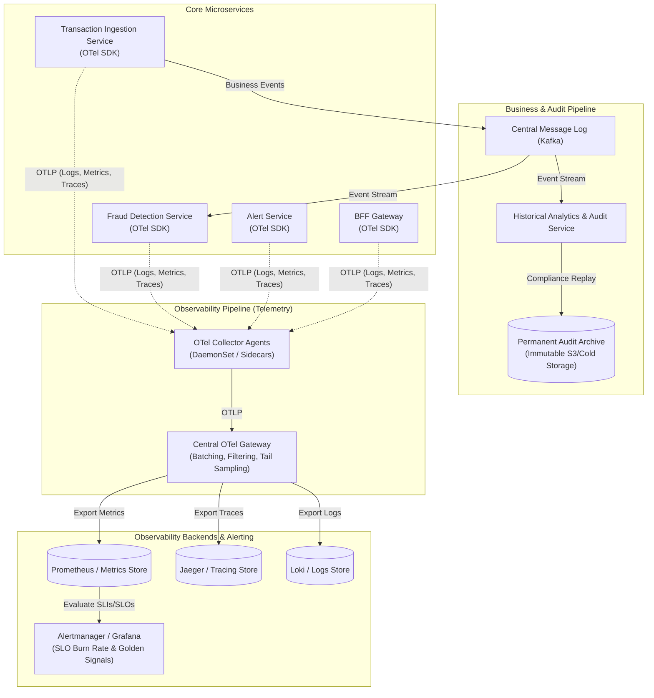

```mermaid
graph TD
    subgraph "Core Microservices"
        S1["Transaction Ingestion Service<br/>(OTel SDK)"]
        S2["Fraud Detection Service<br/>(OTel SDK)"]
        S3["Alert Service<br/>(OTel SDK)"]
        BFF["BFF Gateway<br/>(OTel SDK)"]
    end

    subgraph "Business & Audit Pipeline"
        Kafka["Central Message Log (Kafka)"]
        AuditService["Historical Analytics & Audit Service"]
        AuditArchive[("Permanent Audit Archive<br/>(Immutable S3/Cold Storage)")]

        S1 -->|"Business Events"| Kafka
        Kafka -->|"Event Stream"| S2
        Kafka -->|"Event Stream"| AuditService
        AuditService -->|"Compliance Replay"| AuditArchive
    end

    subgraph "Observability Pipeline (Telemetry)"
        OTelAgent["OTel Collector Agents<br/>(DaemonSet / Sidecars)"]
        OTelGateway["Central OTel Gateway<br/>(Batching, Filtering, Tail Sampling)"]

        S1 -.->|"OTLP (Logs, Metrics, Traces)"| OTelAgent
        S2 -.->|"OTLP (Logs, Metrics, Traces)"| OTelAgent
        S3 -.->|"OTLP (Logs, Metrics, Traces)"| OTelAgent
        BFF -.->|"OTLP (Logs, Metrics, Traces)"| OTelAgent

        OTelAgent -->|"OTLP"| OTelGateway
    end

    subgraph "Observability Backends & Alerting"
        MetricsDB[("Prometheus / Metrics Store")]
        TracesDB[("Jaeger / Tracing Store")]
        LogsDB[("Loki / Logs Store")]
        Alerts["Alertmanager / Grafana<br/>(SLO Burn Rate & Golden Signals)"]

        OTelGateway -->|"Export Metrics"| MetricsDB
        OTelGateway -->|"Export Traces"| TracesDB
        OTelGateway -->|"Export Logs"| LogsDB

        MetricsDB -->|"Evaluate SLIs/SLOs"| Alerts
    end
```