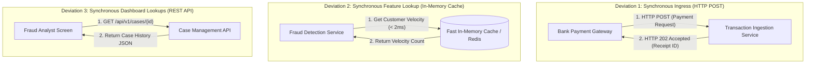

```mermaid
graph TD
    subgraph "Deviation 1: Synchronous Ingress (HTTP POST)"
        Bank["Bank Payment Gateway"] -->|"1. HTTP POST (Payment Request)"| S1["Transaction Ingestion Service"]
        S1 -->|"2. HTTP 202 Accepted (Receipt ID)"| Bank
    end

    subgraph "Deviation 2: Synchronous Feature Lookup (In-Memory Cache)"
        S2["Fraud Detection Service"] -->|"1. Get Customer Velocity (< 2ms)"| Cache[("Fast In-Memory Cache / Redis")]
        Cache -->|"2. Return Velocity Count"| S2
    end

    subgraph "Deviation 3: Synchronous Dashboard Lookups (REST API)"
        Analyst["Fraud Analyst Screen"] -->|"1. GET /api/v1/cases/{id}"| CaseAPI["Case Management API"]
        CaseAPI -->|"2. Return Case History JSON"| Analyst
    end

```