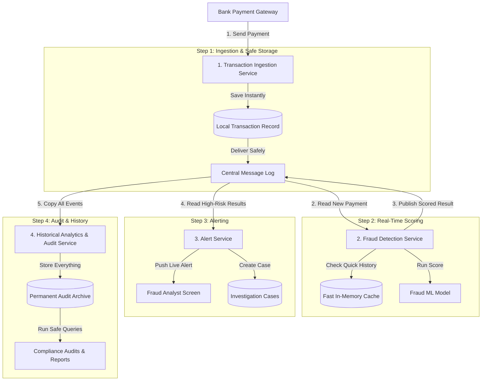
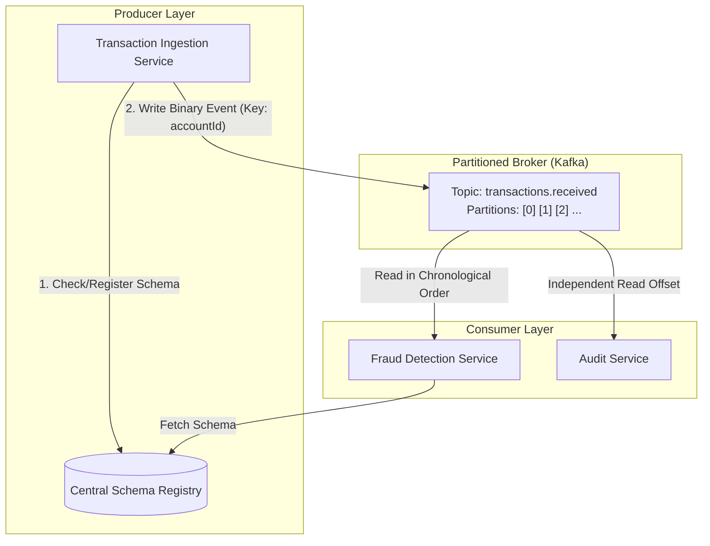

Scenario
You are a software architect at a major financial institution. Your company has completed a major migration and uplift of their services to be cloud native. The one laggard is the aging, batch driven, fraud detection system. The bank needs and is willing to invest in uplift of this in order to better detect fraudulent transactions and remain compliant with new requirements for real-time detection that are due to come into effect soon.

In this project you will analyze the needs of, and design a system that enables a high volume, low latency, financial fraud detection system. The system will accept transactions that the bank processes, analyze and classify these using a machine learning model, and report on the results, as well as issue alerts for transactions found to be fraudulent with a high level of confidence.

There are a number of key criteria that this new system needs to implement in order to fulfill the bank's legal requirements:

The system must provide real time analysis of transactions
Transactions that pass through the system must be captured and be replayable for compliance reasons
The system must support a peak transaction volume of 1,000 transactions per second
There must be elastic scaling of services in order to meet demand during peak load without continuing to incur peak level costs at all times
The system must provide real time alerting of finding via a frontend for fraud analysts
The solution must include observability and alerting components to allow it to be operationalised

---
Fraud Detection System
- Detect fradulent transactions
- Accepts bank transactions as input
- Analyzes and classifies the transactions using a machine learning model
- Reports on the results and issues alerts for fradulent transactions found with high level of confidence
- 1000 transactions/second
- Elastic scaling of services
- Real time alerts via frontend for fraud analysts
- Observability and alerting components must be included

---

What are the core microservices?
(Overall requirements of the solution are broken down into individual microservices that will perform these functional units.
Microservice function, inputs and outputs are considered
Inter-service communication and coupling is considered and discussed.)

```
1. Transaction Ingestion Service
Input: Bank payment request
Output: Bank receipt, Transaction Recived event

2. Fraud Detection Service
Input: Transaction Received event
Output: Fraud score event ( 0 to 100 confidence rating)

3. Alert Service
Input: Fraud score event > 80
Output: An alert to fraud frontend and an investigation ticket

4. Historical Analytics and Audit Service
Input: All events from the central message log
Output: A dataset for training fraud models
```



Three Core Events:
- TransactionReceived
- FraudScore
- FraudAlertCreated



Event 1: TransactionReceived
- What: A record containing the raw payment details from the bank.
- When: Published immediately after Transaction Ingestion Service validates the incoming request and saves it locally.
- Why: Lets the bank receive a confirmation while triggering the fraud detection process in the background.
- Publisher: Transaction Ingestion Service.
- Consumer: Fraud Detection Service, Historical Analytics and Audit Service.

Event 2: FraudScore
- What: The calculated risk rating (confidence rating from 0 to 100), decision status, and model metadata.
- When: Published immediately after Fraud Detection Service runs the transaction through its machine learning model.
- Why: Broadcasts the fraud risk evaluation so the alert system can act if the score is high and the audit system can log the verdict.
- Publisher: Fraud Detection Service.
- Consumer: Alert Service, Historical Analytics and Audit Service.

Event 3: FraudAlertCreated
- What: An alert record containing the transaction details, customer ID, risk rating, and an opened investigation ticket ID.
- When: Publushed by Alert Service when it received a FraudScore event with a score greater than 80.
- Why: Pushes an urgent alert to the fraud analyst frontend and records the investigation file for auditors.
- Publisher: Alert Service
- Consumers: Fraud Analyst Frontend, Historical Analytics and Audit Service

---Architectural decisions that deviate from the event driven pattern---

Deviation 1: Bank payment input
- What: The bank payment gateway connects to Transaction Ingestion Service through synchronous HTTP POST.
- Why: The bank protocol needs an immediate HTTP 202 Accepted request within 20ms to ensure the transaction is safely saved to disk before the network connection closes. If this were an event fired once, lost network packets would result in dropped transactions.

Deviation 2: Fraud analyst case lookups
- What: The fraud analyst frontend queries investigation records and customer history through HTTP GET requests.
- Why: Investigators reviewing flagged accounts need immediate interactive responses for searching, filtering, sorting, and pagination. 

Deviation 3: Fast feature state retrieval
- What: Fraud Detection Service reads recent customer spending directly from an in-memory cache using a synchronous socket call.
- Why: Scoring each transaction requires checking how many payments the user made in the last 10 minutes. A synchronous in-memory read completes in less than 2ms. Firing an asynchronous event would add latency.